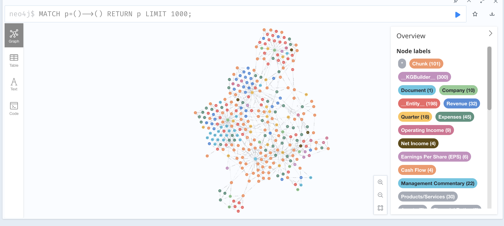

# Neo4j Graph Embedding Project

This project explores graph databases and embeddings using Neo4j. It includes Jupyter notebooks for analysis, configuration files, and relevant resources for working with graph data.

## Project Structure

### Visual Snapshot

Below is a snapshot of the project in action:



### Key Files and Directories

- **`.env`**: Environment variables for configuring the project.
- **`companies.ipynb`**: Jupyter notebook for analyzing company data using graph embeddings.
- **`config.py`**: Python configuration file for setting up the project.
- **`Graph_Databases_for_Beginners.pdf`**: A reference guide for understanding graph databases.
- **`sample.ipynb`**: Another Jupyter notebook for experimentation and testing.
- **`pdfs/`**: Contains financial reports and earnings releases for various companies.

### Prerequisites

- Python 3.12 or higher
- Jupyter Notebook
- Neo4j database setup (ensure Neo4j is installed and running locally or remotely)
- Required Python libraries (install via `requirements.txt`)

### Getting Started

1. Clone the repository:

   ```bash
   git clone <repository-url>
   cd neo4j_graph_embedding
   ```

2. Set up the environment variables:

   - Create a `.env` file in the root directory.
   - Add the necessary configuration details, such as Neo4j credentials and connection URL.

3. Install dependencies:

   ```bash
   pip install -r requirements.txt
   ```

4. Start the Neo4j database and ensure it is accessible.

5. Run the Jupyter notebooks:

   ```bash
   jupyter notebook
   ```

6. Open `companies.ipynb` or `sample.ipynb` to start exploring the data.

### Resources

- **Graph Databases**: Refer to `Graph_Databases_for_Beginners.pdf` for an introduction to graph databases.
- **Financial Reports**: The `pdfs/` directory contains quarterly earnings reports for analysis.

### License

This project is licensed under the MIT License. See `LICENSE` for details.

### Acknowledgments

- Neo4j for providing tools and resources for graph database exploration.
- Authors of the financial reports for the data used in this project.

### Useful Links

- https://neo4j.com/blog/news/graphrag-python-package/
- https://neo4j.com/docs/neo4j-graphrag-python/current/user_guide_rag.html
- https://pypi.org/project/neo4j-graphrag/
